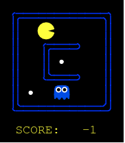

# Apprendre l'apprentissage renforcé avec le Pacman d'UC Berkeley

<p align="center">
  
</p>

L'ambition de ce projet était de se familiariser avec les méthodes du reinforcement learning (RL) en entrainant un "agent" à jouer à un jeu simple.
On a étudié le livre de Sutton et Barto, "Reinforcement Learning: an introduction" (http://incompleteideas.net/book/bookdraft2018jan1.pdf) pour s'initier à la théorie et aux méthodes de RL.
Notre choix de jeu s'est arrêté sur le Pacman du cours "Intro to AI (CS188)" de UC Berkeley (http://ai.berkeley.edu/reinforcement.html) pour ses qualités pédagogiques: 
- le développement des programmes et algorithmes de la partie reinforcement learning suit bien l'élaboration des concepts et méthodes du livre de Barto et Sutton.
- les programmes sont en python en style objet-orienté: La structure hiérarchique des classes reflètent l'organisation et l'interdépendence des concepts dans la théorie.
- le language python permet d'utiliser les packages keras et tensorflow pour la création de réseaux de neurones.

La familiarisation aux concepts du RL se fait en plusieurs étapes avec le cours de UC Berkeley. Dans une première étape, on se familiarise avec les concepts de Markov Decision Process (MDP) et Dynamic Programming (DP). Ces méthodes sont utiles lorsqu'on a une parfaite connaissance du système. Le MDP conceptualise l'intéraction d'un agent avec son environnement. L'intéraction agent-environnement est entièrement caractérisée par les transitions successives entre états (S=State), suivant des choix d'actions (A=Action) de l'agent et résultant en des bonus ou malus pour l'agent (R=Reward): cela donne lieu à des séries S0,A0,R1,S1,A1 ... En outre, le MDP suppose l'existence de probabilités de transition entre les états p(S',R | S,A) et comprend aussi la définition d'un facteur de dévaluation limitant l'importance des récompenses (Reward) obtenues dans un futur lointain.


Dans Pacman, les états du systèmes sont définis par la connaissance des positions de Pacman dans le labyrinthe, les positions des fantômes, et des pastilles. Les actions sont les mouvements dans les 4 directions haut, bas, gauche, droite, ou l'inaction. Les bonus et malus de Pacman sont:
- +10 quand il mange une pastille,
- +200 quand il mange un fantôme après avoir ingéré une pastille magique,
- +500 quand il gagne après avoir mange toutes les pastilles,
- -1 à chaque pas,
- -500 quand il se fait manger par un fantôme.

Objectif des méthodes de Reinforcement Learning: entraîner un agent à evoluer de façon optimale dans un environnment. Dans le cadre d'un jeu comme pacman, le comportement optimal consiste à gagner la partie en obtenant le score maximal.

Comment? La méthode consiste à attribuer à chaque état du système Agent-Environnement une valeur qui correspond à l'espérance du score que l'agent (pacman) peut atteindre dans le futur à partir de cet état S, choisisant l'action A suivant la règle de conduite (policy en anglais) dénotée par pi.


Ainsi, une règle de conduite dite "avide" (greedy policy en anglais) consistera à systématiquement choisir l'action qui conduira à l'espérance de récompense maximum dans le futur immédiat.


## Value Iteration ,Dynamic Programming, Iterative Policy Evaluation

La première partie du cours de UC Berkeley est dediée à l'implémentation de l'algorithme d'itération de la valeur des états dans le cadre d'un environnement connu: les probabilités de transitions entre états sont connues et la méthode de Dynamic Programming consiste à faire converger la fonction Q(S,A) vers sa vraie valeur par un processus itératif. Une itération passe en revue la totalité des états et actualise la valeur de Q(S,A) à partir des valeurs des proches voisins. La valeur de Q s'ajuste de proche en proche à partir des valeurs connues (terminal states) au fur et à mesure des itérations. La convergence est rapide sur des petite grilles d'états. Cette méthode devient trop couteuse en terme de puissance de calcul lorsque le nombre d'états augmente.


A chaque itération, après avoir actualisé la function Q(S,A), on actualise la règle de conduite, le tout formant un processus appelé "iterative policy evaluation".


Intéret: planifier la meilleure stratégie en fonction de certains paramètres lorsque l'environnement est connu par ailleurs.

L'exemple suivant est intéressant pour comprendre l'effet du paramètre gamma, ainsi que le rôle des probabilités de transitions determinées par le paramètre noise. Les probabilités de transition reflètent la capacité de l'agent à effectivement contrôler son évolution dans l'environnement. Le paramètre noise permet d'introduire un caractère aléatoire dans l'évolution d'un hypothétique agent. Dans cet exemple, on pourrait s'intéresser au meilleur trajet pour récupérer un trésor qui se trouve près d'un précipice. Suivant l'état d'ébriété de la personne, le meilleur trajet ne sera pas forcément le plus court qui passe le long du précipice car la personne pourrait faire un pas de travers et tomber. l'état d'ébriété est reflété par le paramètre noise dans l'environnement gridworld des programmes de UC Berkeley. Si la personne a trop bu, elle pourrait ne pas parfaitement contrôler ses mouvements. Ainsi, elle n'aurait par exemple qu'une probabilité p(S+N,-1|S,N)=(1-noise) de se diriger vers le Nord (N) et p(S+X,-1|S,N)=(noise/3) de se diriger dans une autre direction (X) malgré son intention d'aller vers le Nord. 
Le paramètre gamma ,quant à lui, reflète la capacité de la personne à connaître l'environnement lointain. Plus le paramètre gamma est grand et moins les valeurs des états lointain seront propagés. Ainsi, dans cet exemple, la personne pourrait choisir de récolter le trésor de moindre valeur si le paramètre gamma est trop élevé etant donné que les valeurs des états dans la direction du trésor de plus grande valeur auront été trop amoindries par gamma.

Sur cet exemple, discount=0.9, noise=0.2, la route optimale devient le passage loin du précipice pour récupérer le trésor de plus grande valeur car le risque de tomber est trop grand, et le coefficient de dévaluation (discount) n'est pas assez grand pour ne pas "voir" le trésor de plus grande valeur...


## Apprentissage non supervisé: Q-Learning

La deuxième partie du cours de Berkeley s'intéresse aux méthodes de reinforcement learning dans des environnement inconnus, ou l'agent doit apprendre à évoluer au fur et a mesure de son expérience avec l'environnement. On reste dans un paradigme de MDP, mais l'environnement n'étant pas connu, on a plus la possibilité de calculer la valeur des états à partir des autres valeurs d'états connus. L'agent va explorer l'environnement autour de lui et accumuler son expérience dans la fonction Q(S,A) actualisée au fur et a mesure de son cheminement.

Le premier algorithme d'apprentissage que lon doit implémenter dans les programmes de UC Berkeley est l'algorithme de Q-learning (off policy Time Difference TD(0), chapitre 6.5 dans le livre de Sutton et Barto):


Le paramètre alpha introduit, est le coefficient d'apprentissage. Nous remarquons en passant que l'actualisation de la fonction Q(S,A) s'obtient ainsi par intégration progressive des nouvelles valeurs(factor alpha =0.2 typically). On fait tendre Q(S,A) vers la nouvelle estimation de Q(S,A) que l'on vient d'obtenir:


Le choix des actions se fait par une règle de conduite "epsilon-greedy" pour trouver un compromis entre l'exploitation de l'expérience accumulée et l'exploration de nouveaux états. En effet, la plupart du temps (1-epsilon fois en moyenne), l'action validée comme étant la meilleure par l'expérience acquise indiquée par la function Q(S,A) sera choisie. Et certaine fois (epsilon fois en moyenne), une action au hasard sera choisie pour favoriser le maintien de l'exploration de possibles nouvelles stratégies. 

Une démonstration du fonctionnement de cet algorithme peut être faite en utilisant gridworld:

python gridworld.py -a q -k 5 -m


Intéréssons nous maintenant à l'utilisation de cet algorithme pour le jeu de Pacman:

On a expérimenté avec plusieurs labyrinthes:

- La petite grille (smallGrid), qui comporte un seul fantôme, 18 positions et 2 pastilles initialement. Le nombre de différentes configurations possibles de pacman, du fantôme et des pastilles, est de 1224 configurations. En pratique, le nombre de configurations, qui se présentent à l'agent, est bien moindre (~<50?).

<p align="center">

</p>

En moyenne, il faut 0.012 secs pour jouer un jeu (sans visualisation): en seulement environ 2000 itérations et moins de 30 secs, Pacman sort victorieux pratiquement à chaque fois (sur un Intel® Core™ i7-4500U CPU @ 1.80GHz × 4; 8Gb RAM).

<p align="center">

</p>

Le graphe ci-dessous montre une étude de la dépendance du score moyen en fonction du paramètre epsilon: plus epsilon est grand plus on favorise l'exploration de nouvelles actions au détriment de celles apprises. 

<p align="center">

</p>

- la grille moyenne (mediumGrid), qui comporte 1 seul fantôme, 32 positions accessibles et 4 pastilles initialement. En tout, 15872 configurations possibles mais en realité seulement un nombre bien moindre rencontrées par l'agent (~<100?). 

<p align="center">

</p>

Sur la grille moyenne (mediumGrid), nous avons fait jouer le jeu de pacman 24100 fois par l'agent, dont 24000 jeux d'entrainement et 100 jeux de test pendant lesquels alpha=0.

Le graphe ci-dessous montre une étude de la dépendance du score moyen en fonction du paramètre epsilon pour la grille moyenne. Il faut attendre environ 10000 itérations avant que l'agent réussisse à gagner de facon consistente. En moyenne, il faut 0.037 secs pour jouer un jeu (sans visualisation), donc cela prend environ 6 minutes pour entrainer l'agent à jouer à ce jeu et un peu plus de 10 minutes pour qu'il devienne imbattable. 

<p align="center">

</p>

On a enregistré certaines parties à intervalles réguliers pour visualiser l'amélioration au cours de l'entrainement. Voici quelques parties enregistrées: 

- après 2400 parties d'entraînement (epsilon=0.05, alpha=0.2, gamma=0.9):

<p align="center">
  
</p>

- après 4821 parties d'entraînement (epsilon=0.05, alpha=0.2, gamma=0.9), pacman commence à se dégourdir mais perd toujours.

<p align="center">
  
</p>

- après 9641 parties d'entraînement (epsilon=0.05, alpha=0.2, gamma=0.9), pacman commence à gagner des parties.

<p align="center">
  
</p>

- après 24024 parties d'entraînement (epsilon=0.05, alpha=0.2, gamma=0.9), pacman est devenu trop fort!

<p align="center">
  
</p>

- après 24096 parties d'entraînement (epsilon=0.05, alpha=0.2, gamma=0.9), personne n'est infaillible!

<p align="center">
  
</p>

- le labyrinthe "capsuleClassic", qui a 3 fantômes, 56 positions accessibles ,24 pastilles et 3 pastilles magiques (capsules). Le nombre de configuration possible est trés grand, mais le nombre de configurations que rencontrent pacman est beaucoup plus limité (~<1000?). Malgré tout, le nombre de parties à jouer pour explorer les configurations jusqu'à trouver une stratégie pour gagner le jeu devient beaucoup trop important pour que les calculs aboutissent rapidement. En outre, utilisant un laptop avec 8Gb de RAM, nous avons rapidement été limité par la memoire vive après seulement environ 20000 parties jouées. A ce stade, le pacman n'a pas encore pu apprendre à gagner une partie. 

<p align="center">

</p>

## Apprentissage semi-supervisé: Approximate Q-Learning

Pour remédier à ce problème d'apprentissage dans des environnements à grand nombre d'états, nous devons avoir recours à des méthodes d'approximation. Dans le cours de UC Berkeley, une méthode d'approximation linéaire utilisant des "features" est utilisée (cf. livre de Barto and Sutton chapitre 9.4). Ces méthodes permettent de réduire le nombre d'état que l'agent doit explorer pour apprendre à jouer. Elles permettent de trier l'information pertinente. Par exemple, sans approximation, si la même configuration des acteurs (exemple: pacman entouré de 2 fantômes) qui a déjà été "apprise" à un endroit du labyrinthe se reproduit à un autre endroit, elle devra être réapprise de nouveau étant considérée comme un état à priori différent pour l'agent. L'utilisation de features du type "présence de fantômes à proximité" permet de s'abstraire de la position spatiale sur la grille et ainsi il suffit d'apprendre à jouer la configuration une fois pour savoir la jouer à d'autres endroits du labyrinthe.  

Q(S,A) est directement calculée à partir des n features fi(S,A), l'entraînement consiste désormais seulement à déterminer les coeffient wi au lieu de calculer chaque valeur Q(S,A) pour tous les états du systèmes:


En utilisant les features "#-of-ghosts-1-step-away","eats-food", et "closest food" qui indiquent à pacman combien de fantômes sont à proximité, si les pastilles proches peuvent être mangé sans danger, et à quelle distance se trouve les prochaines pastilles, l'entrainement prend seulement quelques itérations même sur un grand labyrinthe.

Mais cela revient à donner des directives à pacman, et donc il ne s'agit plus d'apprentissage non-supervisé. 

## Apprentissage non-supervisé: Deep Q-Learning

De la même manière mais sans donner de directives à Pacman, l'utilisation des réseaux de neuronnes est devenue populaire comme solution d'approximation en reinforcement learning depuis le succès de DeepMind, qui a démontré l'apprentissage de jeux Atari à partir des images de l'écran en utilisant des Convolutional Neural Network comme fonction d'approximation pour les agents (https://storage.googleapis.com/deepmind-media/dqn/DQNNaturePaper.pdf).

Nous n'avons pas eu le temps de faire fonctionner de façon efficace un réseau de neuronne pour entrainer Pacman. Nous y travaillons ... D'autres personnes ont publié leurs programmes sur github, notamment https://github.com/tychovdo/PacmanDQN, qui réussit à entraîner Pacman à partir des images de l'écran.  


You can use the [editor on GitHub](https://github.com/brunolune/brunolune.github.io/edit/master/README.md) to maintain and preview the content for your website in Markdown files.

Whenever you commit to this repository, GitHub Pages will run [Jekyll](https://jekyllrb.com/) to rebuild the pages in your site, from the content in your Markdown files.

### Markdown

Markdown is a lightweight and easy-to-use syntax for styling your writing. It includes conventions for

```markdown
Syntax highlighted code block

# Header 1
## Header 2
### Header 3

- Bulleted
- List

1. Numbered
2. List

**Bold** and _Italic_ and `Code` text

[Link](url) and 
```

For more details see [GitHub Flavored Markdown](https://guides.github.com/features/mastering-markdown/).

### Jekyll Themes

Your Pages site will use the layout and styles from the Jekyll theme you have selected in your [repository settings](https://github.com/brunolune/brunolune.github.io/settings). The name of this theme is saved in the Jekyll `_config.yml` configuration file.

### Support or Contact

Having trouble with Pages? Check out our [documentation](https://help.github.com/categories/github-pages-basics/) or [contact support](https://github.com/contact) and we’ll help you sort it out.
