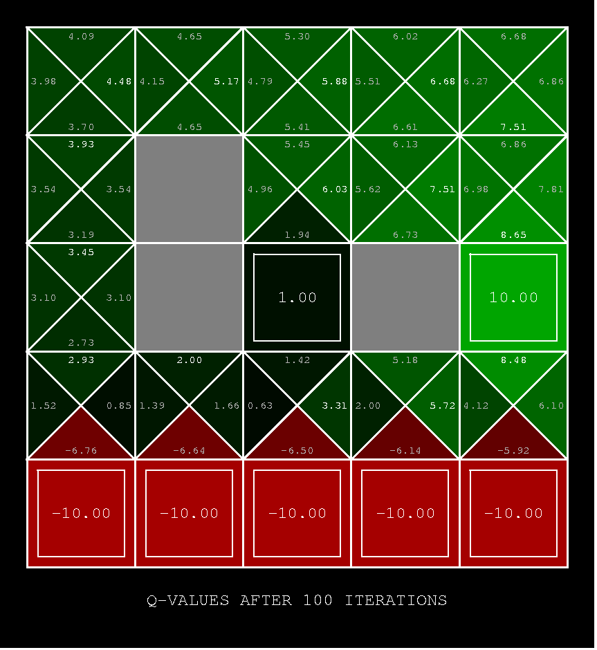
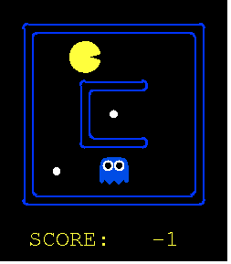
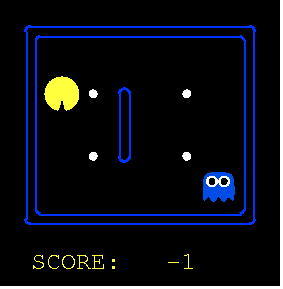
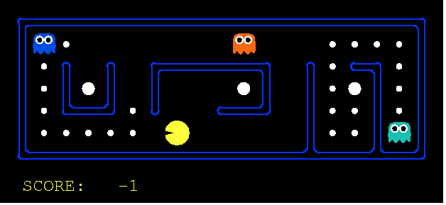
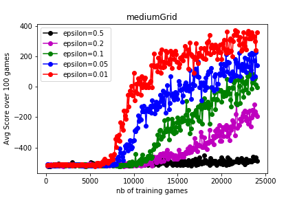
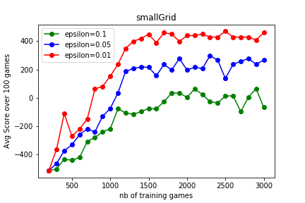

## Apprendre l'apprentissage renforcé avec le Pacman d'UC Berkeley

<p align="center">
  
</p>

L'ambition de ce projet était de se familiariser avec les méthodes du reinforcement learning (RL) en entrainant un "agent" à jouer à un jeu simple.
On a utilisé le livre de Sutton et Barto, "Reinforcement Learning: an introduction" (http://incompleteideas.net/book/bookdraft2018jan1.pdf), pour s'initier à la théorie et aux méthodes de RL.
Notre choix de jeu s'est arrêté sur le Pacman du cours "Intro to AI (CS188)" de UC Berkeley (http://ai.berkeley.edu/reinforcement.html) pour ses qualités pédagogiques: 
- le développement des programmes et algorithmes de la partie reinforcement learning suit bien l'élaboration des concepts et méthodes du livre de Barto et Sutton.
- les programmes sont en python en style objet orienté: La structure hiérarchique des classes reflètent l'organisation et l'interdépendence des concepts dans la théorie.
- le language python permet d'utiliser les packages keras et tensorflow pour la création de réseaux de neurones.

La familiarisation aux concepts du RL se fait en plusieurs étapes avec le cours de UC Berkeley. Dans une première étape, on se familiarise avec les concepts de Markov Decision Process (MDP) et Dynamic Programming (DP). Ces méthodes sont utiles lorsqu'on a une parfaite connaissance du système. Le MDP conceptualise l'interaction d'un agent avec son environnement. L'interaction agent-environnement est entièrement caractérisée par les transitions successives entre états (S=State), suivant des choix d'actions (A=Action) de l'agent et résultant en des bonus ou malus pour l'agent (R=Reward): cela donne lieu à des séries S0,A0,R1,S1,A1 ... En outre, le MDP suppose l'existence de probabilités de transition entre les états p(S',R | S,A) et comprend aussi la définition d'un facteur de dévaluation limitant l'importance des récompenses (Reward) obtenues dans un futur lointain. Dernier point important: la valeur V(S) d'un état du système ne prend en compte que l'état présent et futur du système ("the future is independent of the past given the present").Les experiences du passe sont accumule l'experience dans la valeur de l'etat ie de la qvalues.


Dans Pacman, les états du systèmes sont définis par la connaissance des positions de Pacman dans le labyrinthe, les positions des fantômes, et des pastilles. Les actions sont les mouvements dans les 4 directions haut, bas, gauche, droite, ou l'inaction. Les bonus et malus de Pacman sont:
- +10 quand il mange une pastille,
- +200 quand il mange un fantôme après avoir ingéré une pastille magique,
- +500 quand il gagne après avoir mange toutes les pastilles,
- -1 à chaque pas,
- -500 quand il se fait manger par un fantôme.

Objectif des méthodes de Reinforcement Learning: entraîner un agent à evoluer de façon optimale dans un environnment. Dans le cadre d'un jeu comme pacman, le comportement optimal consiste à gagner la partie en obtenant le score maximal.

Comment? La méthode consiste à attribuer à chaque état du système Agent-Environnement une valeur qui correspond à l'espérance du score que l'agent (pacman) peut atteindre dans le futur à partir de cet état S, choisisant l'action A suivant la règle de conduite (policy en anglais) dénotée par pi.


Ainsi, une règle de conduite dite "avide" (greedy policy en anglais) consistera à systématiquement choisir l'action qui conduira à l'espérance de récompense maximum dans le futur immédiat.


La première partie du cours de UC Berkeley est dediée à l'implémentation de l'algorithme d'itération de la valeur des états dans le cadre d'un environnement connu: les probabilités de transitions entre états sont connues et la méthode de Dynamic Programming consiste à faire converger la fonction Q(S,A) vers sa vraie valeur par un processus itératif. Une itération passe en revue la totalité des états et actualise la valeur de Q(S,A) à partir des valeurs des proches voisins. La valeur de Q s'ajuste de proche en proche à partir des valeurs connues (terminal states) au fur et à mesure des itérations. La convergence est rapide sur des petite grilles d'états. Cette méthode devient trop couteuse en terme de puissance de calcul lorsque le nombre d'états augmente.


A chaque itération, après avoir actualisé la function Q(S,A), on actualise la règle de conduite, le tout formant un processus appelé "iterative policy evaluation".


Intéret: planifier la meilleure stratégie en fonction de certains paramètres lorsque l'environnement est connu par ailleurs.

L'exemple suivant est intéressant pour comprendre l'effet du paramètre gamma, ainsi que le rôle des probabilités de transitions determinée par le paramètre noise. Les probabilités de transition reflètent la capacité de l'agent à effectivement contrôler son évolution dans l'environnement. Le parametre noise permet d'introduire un caractère aléatoire dans l'évolution d'un hypothétique agent. Dans cet exemple,on pourrait s'intéresser au meilleur trajet pour récupérer un trésor qui se trouve près d'un précipice. Suivant l'état d'ébriété de la personne, le meilleur trajet ne sera pas forcement le plus court qui passe le long du precipice car la personne pourrait faire un pas de travers et tomber.letat d'ebriete est reflete par le parametre noise dans l'environnement gridworld des programmes de UC Berkeley. Si la personne a trop bu, elle pourrait ne pas parfaitement controler ses mouvements ainsi elle n'aurait par exemple qu'une probabilite p(S+N,-1|S,N)=1-noise de se diriger vers le Nord (N) et p(S+X,-1|S,N)=noise/3 de se diriger dans une autre direction (X) malgre son intention d'aller vers le Nord. 
Le parametre gamma ,quant a lui, reflete la capacite de la personne a connaitre l'environnement lointain. plus le parametre gamma est grand et moins les qvalues des etats lointain seront propage. Ainsi, dans cet exemple, la personne pourrait choisir de recolter le tresor de moindre valeur si le parametre gamma est trop eleve etant donne que la valeur des etats dans la direction du tresor de plus grande valeur auront ete trop diminuee par gamma.


Sur cet exemple, discount=0.9, noise=0.2, la route optimale devient le passage loin du precipice pour recuperer le tresor de plus grande valeur car le risque de tomber est trop grand, et le coefficient de devaluation (discount) n'est pas assez grand pour ne pas "voir" le tresor de plus grande valeur.





La deuxieme partie du cours de Berkeley sinteresse aux methodes de reinforcement learning dans des environnement inconnus, ou l'agent doit apprendre a evoluer au fur et a mesure de son experience avec l'environnement. On reste dans un paradigme de MDP, mais l'environnement n'etant pas connu, on a plus la possibilite de calculer la valeur des etats a partir des autres valeurs d'etats connus. L'agent va explorer l'environnement autour de lui et accumuler son experience dans la fonction Q(S,A) actualisee au fur et a mesure de son cheminement.

Le premier algorithme d'apprentissage que lon doit implementer dans les programmes de UC Berkeley est l'algorithme de Q-learning (off policy Time Difference TD(0), chapitre 6.5 dans le livre de Sutton et Barto):


Le parametre alpha introduit est le coefficient d'apprentissage. Nous remarquons en passant que l'actualisation de la fonction Q(S,A) s'obtient ainsi par integration progressive des nouvelles valeurs(factor alpha =0.2 typically). On fait tendre Q(S,A) vers la nouvelle estimation de Q(S,A) que l'on vient d'obtenir:

Le choix des actions se fait par une regle de conduite "epsilon-greedy" pour trouver un compromis entre l'exploitation de l'experience accumulee et l'exploration de nouveaux etats. En effet, la plupart du temps (1-epsilon fois en moyenne), l'action validee comme etant la meilleure par l'experience acquise indiquee par la function Q(S,A) sera choisie. Et certaine fois (epsilon fois en moyenne), une action au hasard sera choisie pour favoriser le maintien de l'exploration de possible nouvelle strategie. 

Une demonstration du fonctionnement de cet algorithme peut etre faite en utilisant gridworld:
python gridworld.py -a q -k 5 -m


Interessons nous maintenant a l'utilisation de cet algorithme pour le jeu de Pacman:

On a experimente avec plusieurs labyrinthes:
- La petite grille, qui comporte 1 seul fantome, 18 positions et 2 pastilles initialement. Le nombre de differentes configurations possibles de pacman, du fantome et des pastilles, est de 1224 configurations. En pratique, le nombre de configurations, qui se presentent a l'agent, est bien moindre (~<100). En moyenne, il faut secs pour jouer un jeu,

<p align="center">

</p>

- la grille medium, qui comporte 1 seul fantome, 32 positions accessibles et 4 pastilles initialement. En tout, 15872 configurations possibles mais en realite seulement un nombre bien moindre rencontrees par l'agent (~<100?). 

<p align="center">

</p>

- le labyrinthe "capsuleClassic", qui a 3 fantomes, 56 positions accessibles ,24 pastilles et 3 pastilles magiques (capsules). Le nombre de configuration possible est tres grand, mais le nombre de configurations que rencontrent pacman beaucoup limite (~<1000?)

<p align="center">

</p>

Sur une grille moyenne (mediumGrid), nous avons fait jouer le jeu de pacman 24100 fois par l'agent, dont 24000 jeux d'entrainement et 100 jeux de test pendant lesquels alpha=0. On a enregistre certaines parties a intervalles reguliers pour visualiser l'amelioration au cours de l'entrainement. Voici quelques parties enregistrees: 


apres 2400 parties d'entrainement (epsilon=0.05, alpha=0.2, gamma=0.9):

<p align="center">
  
</p>

apres 4821 parties d'entrainement (epsilon=0.05, alpha=0.2, gamma=0.9), pacman commence a se degourdir mais perd toujours.

<p align="center">
  
</p>

apres 9641 parties d'entrainement (epsilon=0.05, alpha=0.2, gamma=0.9), pacman commence a gagner des parties.

<p align="center">
  
</p>

apres 24024 parties d'entrainement (epsilon=0.05, alpha=0.2, gamma=0.9), pacman est trop fort!

<p align="center">
  
</p>

apres 24096 parties d'entrainement (epsilon=0.05, alpha=0.2, gamma=0.9), personne n'est infaillible!

<p align="center">
  
</p>







On voit donc la necessite d'utiliser des methodes d'approximation ...

You can use the [editor on GitHub](https://github.com/brunolune/brunolune.github.io/edit/master/README.md) to maintain and preview the content for your website in Markdown files.

Whenever you commit to this repository, GitHub Pages will run [Jekyll](https://jekyllrb.com/) to rebuild the pages in your site, from the content in your Markdown files.

### Markdown

Markdown is a lightweight and easy-to-use syntax for styling your writing. It includes conventions for

```markdown
Syntax highlighted code block

# Header 1
## Header 2
### Header 3

- Bulleted
- List

1. Numbered
2. List

**Bold** and _Italic_ and `Code` text

[Link](url) and 
```

For more details see [GitHub Flavored Markdown](https://guides.github.com/features/mastering-markdown/).

### Jekyll Themes

Your Pages site will use the layout and styles from the Jekyll theme you have selected in your [repository settings](https://github.com/brunolune/brunolune.github.io/settings). The name of this theme is saved in the Jekyll `_config.yml` configuration file.

### Support or Contact

Having trouble with Pages? Check out our [documentation](https://help.github.com/categories/github-pages-basics/) or [contact support](https://github.com/contact) and we’ll help you sort it out.
